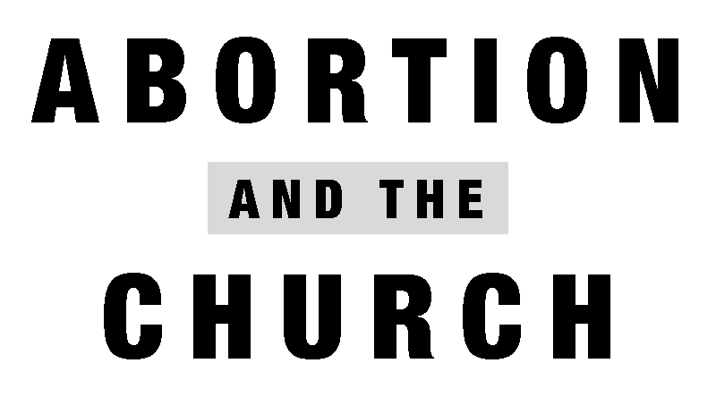

--- 
title: "Abortion and the Church"
author: "Evangel Presbytery"
date: "2022"
description: "In this work, the men of Evangel Presbytery expose the horrors of abortion, and then proceed to lay out the many arguments which exist against the practice of abortion. The concluding chapter explains the biblical foundation of what it looks like for (1) civil authorities, (2) church authorities, and (3) individuals to act and speak faithfully regarding the slaughter of the unborn. In the end, abortion will continue until the church embraces God's beautiful blessing of fruitfulness, especially in His giving of woman to be the giver of life."
params:
  pubinfo: "Originally published as “Abortion and the Church,” statement by Evangel Presbytery, June 24, 2022."
  build: "0"
cover-image: "https://raw.githubusercontent.com/Evangel-Presbytery/Abortion-and-the-Church/master/cover.jpg"
url: "https://abortion.evangelpresbytery.com/"
favicon: "evangel-favicon-196.png"
apple-touch-icon: "evangel-apple-icon.png"
output: 
  bookdown::gitbook:
    config:
      toc:
        scroll_highlight: yes
        before: |
          <li></li>
          <li><a href="./">Abortion and the Church</a></li>
          <li><a class="pdf-download" href="https://github.com/Evangel-Presbytery/Abortion-and-the-Church/raw/master/Ebook-Downloads/Abortion%20and%20the%20Church_Evangel%20Presbytery.pdf">Download PDF</a></li>
          <li><a class="external-link" href="https://evangelpresbytery.com">Evangel Presbytery</a></li>
        after: |
documentclass: book
always_allow_html: yes
site: bookdown::bookdown_site
---

# Publication Information {.unlisted .unnumbered}

For behold, the [Lord]{.smallcaps} is about to come out from His place

To punish the inhabitants of the earth for their iniquity;

And the earth will reveal her bloodshed

And will no longer cover her slain.

Isaiah 26:21

© 2022 by [Evangel Presbytery](https://evangelpresbytery.com). All rights reserved.

Unless otherwise indicated, all Scripture quotations are from the NEW AMERICAN STANDARD BIBLE®, ©\ 1960, 1962, 1963, 1968, 1971, 1972, 1973, 1975, 1977, 1995 by The Lockman Foundation. Used by permission.

**ISBN-13**  
Spiral: 978-1-940017-46-4 (available from [Warhorn Media](https://warhornmedia.com/product/abortion-and-the-church/))  
PDF: 978-1-940017-47-1 (<a href="./Ebook-Downloads/Abortion%20and%20the%20Church_Evangel%20Presbytery.pdf">Download PDF</a>)  
EPUB: 978-1-940017-48-8 (<a href="https://github.com/Evangel-Presbytery/Abortion-and-the-Church/raw/master/Ebook-Downloads/Abortion-and-the-Church.epub">Download EPUB</a>)  
Kindle: 978-1-940017-49-5 (Download <a href="https://github.com/Evangel-Presbytery/Abortion-and-the-Church/raw/master/Ebook-Downloads/Abortion-and-the-Church.mobi">Mobi</a>, <a href="https://github.com/Evangel-Presbytery/Abortion-and-the-Church/raw/master/Ebook-Downloads/Abortion-and-the-Church.azw3">AZW3</a>, or <a href="https://github.com/Evangel-Presbytery/Abortion-and-the-Church/raw/master/Ebook-Downloads/Abortion-and-the-Church.kfx">KFX</a>)

For more information on Evangel Presbytery, please visit [evangelpresbytery.com](https://evangelpresbytery.com/).

For more information on Warhorn Media, please visit [warhornmedia.com](https://warhornmedia.com/).
